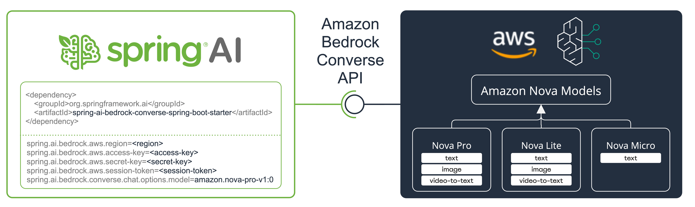

# Spring AI Bedrock Nova Demo

NOTE: depends on PR: https://github.com/spring-projects/spring-ai/pull/1888

This project demonstrates the integration of Amazon Bedrock's Converse API with Spring AI, showcasing various AI capabilities including text generation, multimodal inputs (images, video, documents), and function/tool calling.



## Features

The demo application showcases the following capabilities:

1. **Text Generation**: Basic text-based chat interactions
2. **Image Analysis**: Processing and analyzing images using AI
3. **Video Analysis**: Processing and analyzing video content
4. **Document Processing**: PDF document analysis and summarization
5. **Tool Integration**: Weather information retrieval through function calling

## Prerequisites

- Java 17 or later
- Maven
- AWS Account with Bedrock access
- AWS credentials configured
- Enabled models in AWS Bedrock Console

## Setup

1. Configure AWS credentials either through environment variables or AWS credentials file:
   ```bash
   export AWS_ACCESS_KEY_ID=your_access_key
   export AWS_SECRET_ACCESS_KEY=your_secret_key
   export AWS_SESSION_TOKEN=your_session_token  # if using temporary credentials
   ```

2. Configure application.properties:
   ```properties
   spring.ai.bedrock.aws.region=your-region
   spring.ai.bedrock.aws.access-key=${AWS_ACCESS_KEY_ID}
   spring.ai.bedrock.aws.secret-key=${AWS_SECRET_ACCESS_KEY}
   spring.ai.bedrock.aws.session-token=${AWS_SESSION_TOKEN}
   ```

## Running the Application

1. Build the project:
   ```bash
   ./mvnw clean package
   ```

2. Run the application:
   ```bash
   ./mvnw spring-boot:run
   ```

## Implementation Details

The main application class `BedrockNovaApplication` demonstrates:

- Setting up Spring AI with Bedrock Converse API
- Configuring chat client with various capabilities
- Processing different types of inputs (text, image, video, PDF)
- Implementing function calling for weather information

## Resources

- [Spring AI Documentation](https://docs.spring.io/spring-ai/reference/)
- [Amazon Bedrock Documentation](https://docs.aws.amazon.com/bedrock/latest/userguide/what-is-bedrock.html)
- [Bedrock Converse API Documentation](https://docs.aws.amazon.com/bedrock/latest/userguide/conversation-inference.html)
